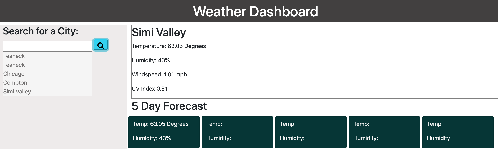

# Weather Search

## Introduction

This repository provides the HTML, CSS, and Javascript files for a weather search. The app provides an opportunity to insert and any city and will provide the current weather as well as a 5-day forecast.

The website incorporates several HTML5, CSS, and Javascript skills including the DOM manipulation and the OpenWeather API.

## Installation

To view the repository as well as the actual webpage, please use the following link. https://bk7711.github.io/weatherSearch/ - Weather Search

Below is a preview of the html:
